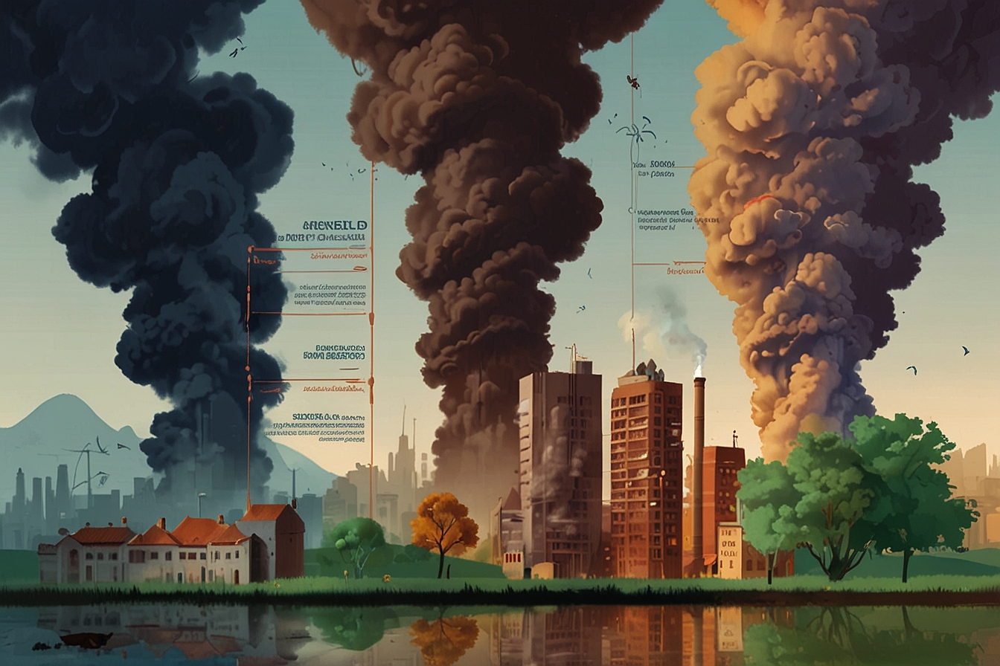

# Datamaterasu - Milestone 2

Two A4 pages describing the project goal.

* Include sketches of the visualization you want to make in your final product.
* List the tools that you will use for each visualization and which (past or future) lectures you will need.
* Break down your goal into independent pieces to implement. Try to design a core visualization (minimal viable product) that will be required at the end. Then list extra ideas (more creative or challenging) that will enhance the visualization but could be dropped without endangering the meaning of the project.

Functional project prototype review.

* You should have an initial website running with the basic skeleton of the visualization/widgets

---

## Sketches

We came up with a few different ideas for representing global emission data. One idea was to use a heatmap to represent a country's global contributions, relative to other countries:

Another idea was to simply have each country be clickable, and have that country's statistics appear as a pop-up:

We also considered a "heatmap-style" idea with circles of varying sizes centered on each country, with the size of the circle proportional to the country's global emissions:

As the project is completely digital, we believe that it would be more interactive and interesting for the user to interact with a 3D globe rather than a simple 2D map. The following sketches show the same heatmap idea as above, as well as using the third (vertical) dimension to show contributions as bars rising from various points along the globe. The height and color of the bars could be used to represent a relative ranking in emissions.

To help in telling a proper story, we would also like to have information related to the effect and impact that emissions could cause on the world. The following illustrations demonstrate the idea:

## Tools + Lectures
To create the visualization, we will make use of the following lectures' content:

* Interactions: filtering, aggregation, transitions, and navigation
* Do's & Dont's: Justifying the use of 3D, clearing clutter
* Maps: Various projections, normalization of data, using cartograms

Some tools that may be useful in creating the visualization:

* [Globe.gl](https://globe.gl/): UI component for globe visualization
* [Cesium](https://github.com/CesiumGS/cesium): Map + Globe visualizer using JS and WebGL
* [d3-geomap](https://d3-geomap.github.io/): 2D map visualizer, built on D3.js
* [Leaflet](https://leafletjs.com/): Simple 2D maps
* [fullPage.js](https://alvarotrigo.com/fullPage/docs/): Easily create full-screen scrolling webpages

## Breakdown
To implement the basic visualization, we have broken down the project into smaller tasks as follows:

* Clean the input emission data
* Collect the emission data into JS, and attach it to a Globe.gl element
* Collect and clean data relating emissions to future consequences (temperature increase, sea level rise, etc.)
* Display the "future consequences" data either as a time-series graph or various illustrations
* A basic write-up of potential solutions to the challenge of global emissions and minimizing future consequences, with examples

To give our visualization and the story more meaning, we would also like to implement the following on top of the basic premise:

* Ability to focus and filter within the Globe.gl visualization, such as filtering emissions by industry or focusing to emissions per city, rather than per country
* Showcase the "future consequences" data at a global scale, either on a 2D map or 3D globe, demonstrating the increased frequency and geographic location of natural disasters and other consequences
* Similarly, demonstrate the advance and implementation of potential solutions with concrete examples by country and industry
* Graph the implementation of implemented solutions against the rate of consequences, showcasing how the solutions have real-world affects

## Basic Prototype
We have created a basic prototype of the webpage with a simple Globe.gl visualization, which can be found [here](https://freedentgoutgit.github.io/Datamaterasu/website/) or by running a basic web server in the `website/` directory

